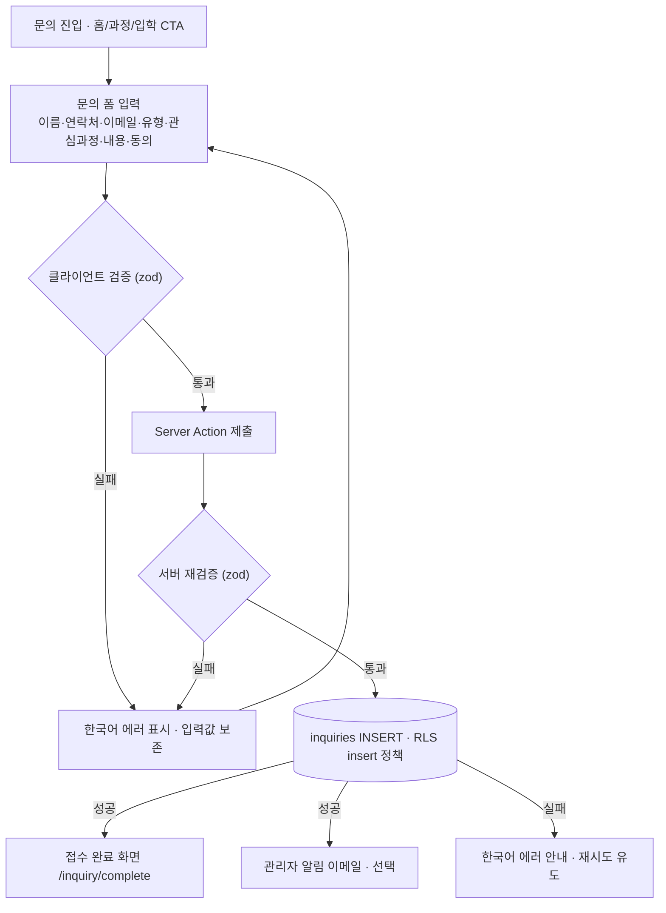
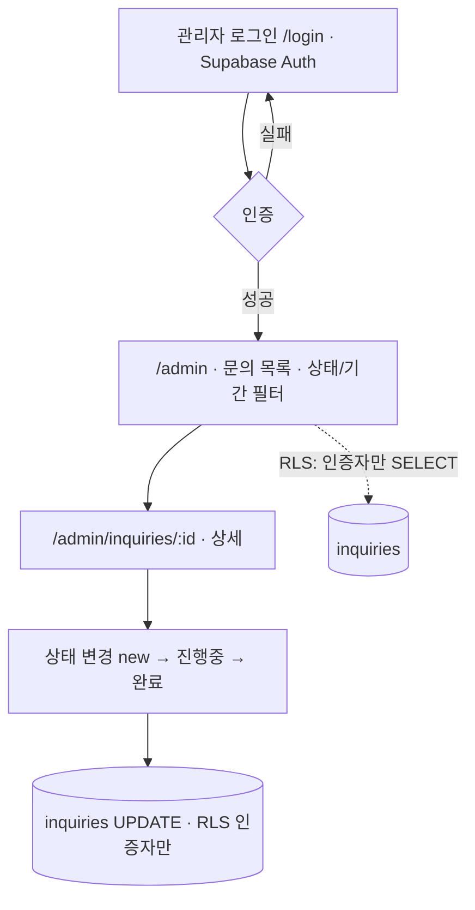
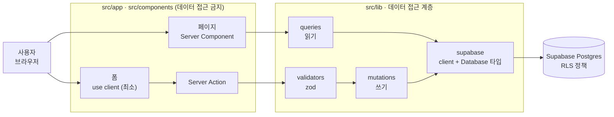

# 온라인 대학 홈페이지 — Phase 1 설계

> 사이트 구조 · User Flow · 기술 스택 설계안

| 항목 | 내용 |
|---|---|
| 제품 | 온라인 대학 웹 서비스 |
| 범위 | Phase 1 · 홈페이지 |
| 1차 목표 | 문의 접수 전환 |
| 기준 문서 | `CLAUDE.md` |
| 상태 | **설계 확정 — 구현 착수** |
| 작성일 | 2026-07-16 |
| 확정일 | 2026-07-23 |

대학 소개와 **입학·과정 문의 접수**를 목표로 하는 1단계 홈페이지의 정보구조, 사용자 흐름, 기술 아키텍처 설계안이다. LMS는 2단계 확장으로 분리하여 이 문서에서는 확장 포인트만 표시한다.

---

## 00. 설계 전제

아래 가정을 바탕으로 설계했다. 사실과 다르면 카피·라우트만 교체하면 되며, 구조는 유지된다.

- **범위** — Phase 1은 **대학 소개 + 입학·과정 문의 접수**. 수강신청·강의·평가·결제(=LMS)는 **비범위**(2단계).
- **맥락 가정** — KACI×GCU AI융합 학위과정. 미확정 시 화면 카피만 교체(구조 불변).
- **1차 전환 지표** — 문의 폼 제출 건수. 모든 정보 페이지는 문의 CTA를 상시 노출.
- **기술 제약** — `CLAUDE.md` 준수: Next.js App Router · TS strict · Tailwind · Supabase+RLS · Vercel · 모든 DB 접근은 `src/lib` 경유 · 화면 카피 한국어.

> ⚠️ **CLAUDE.md 규칙 준수** — "범위 확정 전 LMS 도메인 테이블·화면을 임의로 추가하지 않는다." 따라서 데이터 모델은 `inquiries` 한 테이블로 한정하고, LMS 테이블은 §04에 설계 훅으로만 남긴다.

---

## 01. 사이트 구조 (IA)

Next.js App Router 라우트 그룹 기준. 공개 사이트와 관리자 영역을 레이아웃으로 분리한다.

```
src/app/
├─ /                         홈 — 히어로·핵심강점·과정요약·입학일정·문의 CTA
├─ (marketing)/             공개 레이아웃(헤더·푸터)
│  ├─ /about               소개 — 기관·파트너십(KACI·GCU)·비전·오시는 길
│  ├─ /programs            과정 목록(카드)
│  │  └─ /programs/[slug]  과정 상세 — 커리큘럼·학위·기간·대상·문의 CTA
│  ├─ /admissions          입학 안내 — 모집요강·전형절차·일정·장학
│  ├─ /faq                 자주 묻는 질문 (문의량 절감)
│  ├─ /inquiry             ★ 입학·과정 문의 폼 (1차 전환)
│  │  └─ /inquiry/complete 접수 완료 안내
│  ├─ /privacy             개인정보처리방침 (동의 근거 · 필수)
│  └─ /terms               이용약관
├─ /login                    관리자 로그인 (Supabase Auth)
└─ (admin)/                  인증 가드 레이아웃
   ├─ /admin              문의 목록 — 상태·기간 필터, 최신순
   └─ /admin/inquiries/[id] 문의 상세 + 상태 변경
```

### 라우트 레퍼런스

| 라우트 | 구분 | 렌더링 | 역할 |
|---|---|---|---|
| `/` | PUBLIC | Server | 랜딩 · 전환 유도 허브 |
| `/about` | PUBLIC | Server | 신뢰 형성 (기관·파트너십) |
| `/programs` | PUBLIC | Server | 과정 카드 목록 |
| `/programs/[slug]` | PUBLIC | Server | 과정 상세 · 문의 진입점 |
| `/admissions` | PUBLIC | Server | 지원 요건·일정 안내 |
| `/inquiry` | PUBLIC | Server + 폼(client) | **문의 접수 (핵심)** |
| `/inquiry/complete` | PUBLIC | Server | 접수 완료 확인 |
| `/privacy`, `/terms` | PUBLIC | Server(정적) | 동의 근거 · 법적 고지 |
| `/login` | ADMIN | client(Auth) | 관리자 인증 |
| `/admin` | ADMIN | Server(가드) | 문의 목록·필터 |
| `/admin/inquiries/[id]` | ADMIN | Server(가드) | 상세·상태 변경 |

**전역 요소** — 헤더(로고·주요 메뉴·문의 CTA 버튼), 푸터(기관 정보·개인정보처리방침·연락처). 노출 문자열은 `CLAUDE.md §6`에 따라 한 곳(예: `src/lib/i18n` 또는 `constants`)에 모아 다국어 확장에 대비한다.

---

## 02. User Flow

주 사용자는 예비 지원자다. 모든 탐색 경로가 문의 폼으로 수렴하도록 설계했다.

### 대상 사용자

| 페르소나 | 목표 | 핵심 경로 |
|---|---|---|
| 예비 지원자 *(주 타겟)* | 과정 파악 후 문의 | `/` → `/programs/[slug]` → `/inquiry` |
| 성인·재직 학습자 | 입학 요건·일정 확인 | `/admissions` → `/faq` → `/inquiry` |
| 운영 관리자 | 문의 열람·후속 처리 | `/login` → `/admin` |

### Flow A — 탐색 → 전환 퍼널

```
A1 진입          A2 탐색            A3 확신             A4 문의 접수 ★
홈/검색/광고  →  과정·소개·입학  →  커리큘럼·일정·FAQ  →  폼 제출 → 완료
```

각 정보 페이지(홈·과정 상세·입학 안내)에 문의 CTA를 상시 배치해 어느 단계에서든 A4로 이탈 없이 진입하게 한다.

### Flow B — 문의 접수 (검증·에러 포함)



`CLAUDE.md §5`에 따라 **클라이언트 검증만 신뢰하지 않고 서버에서 zod로 재검증**한다. 개인정보 수집·이용 동의(`privacy_consent`)는 필수값이다.

### Flow C — 관리자 문의 관리



문의 데이터는 개인정보이므로 **익명 사용자는 조회 불가**. `SELECT/UPDATE`는 인증된 관리자에게만 RLS로 허용한다.

---

## 03. 기술 스택 & 아키텍처

확정 스택은 CLAUDE.md를 그대로 따르고, 추가 의존성은 승인 대상으로 분리했다.

### 확정 스택 (CLAUDE.md 고정)

| 레이어 | 기술 | 제약 |
|---|---|---|
| 프레임워크 | Next.js (App Router) | Pages Router 금지 |
| 언어 | TypeScript | `strict:true` · `any` 금지 |
| 스타일 | Tailwind CSS | 인라인 style 지양 |
| DB · 인증 | Supabase (Postgres + Auth) | 모든 테이블 RLS 필수 |
| 배포 | Vercel | Preview → Production |

### 추가 제안 (승인 필요 · CLAUDE.md §7)

| 패키지 | 용도 | 구분 |
|---|---|---|
| `zod` | 입력 스키마 검증(클라+서버) | ✅ **승인** — M1에서 설치 |
| `@supabase/ssr` | 서버/클라 클라이언트 · 쿠키 세션 | ✅ **승인** — M1에서 설치 |
| `react-hook-form` | 폼 상태·UX | ❌ **미도입** — Server Action + `useActionState`로 처리 |
| Resend (HTTP API) | 관리자 문의 알림 | ✅ **승인** — M2. SDK 미도입, `fetch` 로 REST 직접 호출(패키지 추가 없음) |
| Cloudflare Turnstile | 스팸 방지 | ✅ **승인** — M2. 공식 스크립트 명시적 렌더링 + siteverify 직접 호출(패키지 추가 없음) |
| Honeypot | 스팸 방지(무의존) | ✅ 기본 적용 — 추가 패키지 없음 |

### 데이터 접근 아키텍처 (CLAUDE.md §3·§4)



`src/app`·`src/components`는 Supabase 클라이언트를 직접 생성하거나 `.from()`을 호출하지 않고, `src/lib`가 노출한 함수만 호출한다. 쓰기는 Server Action → validators → mutations 경로로 고정한다.

### 디렉터리 구조

```
src/
├─ app/
│  ├─ (marketing)/  layout · page · about · programs · admissions · inquiry …
│  ├─ (admin)/      layout(가드) · admin · admin/inquiries/[id]
│  └─ login/
├─ components/       재사용 UI (데이터 접근 금지)
├─ lib/              ★ 데이터 접근 계층
│  ├─ supabase/      server.ts · client.ts · database.types.ts(생성)
│  ├─ queries/       inquiries.ts (listInquiries, getInquiry)
│  ├─ mutations/     inquiries.ts (createInquiry, updateStatus)
│  └─ validators/    inquiry.ts (zod 스키마)
└─ types/            공용 타입
```

### 데이터 모델 — `inquiries` (Phase 1 유일 테이블)

| 컬럼 | 타입 | 설명 |
|---|---|---|
| `id` | uuid PK | `default gen_random_uuid()` |
| `created_at` | timestamptz | `default now()` |
| `name` | text | 문의자 이름 · not null |
| `email` | text | 회신 이메일 · not null |
| `phone` | text | 연락처 · nullable |
| `inquiry_type` | text | 입학 / 과정 / 기타 · not null |
| `program_slug` | text | 관심 과정 · nullable |
| `message` | text | 문의 내용 · not null |
| `privacy_consent` | boolean | 수집·이용 동의 · **true 필수** |
| `status` | text | `default 'new'` · new/in_progress/done |

### RLS 정책 (최소 권한)

| 동작 | 대상 | 정책 |
|---|---|---|
| 테이블 | — | `enable row level security` — 생성 마이그레이션과 **동일 커밋** |
| `INSERT` | anon | 공개 접수(의도된 공개 쓰기). `with check`로 필수값 + `privacy_consent = true` 강제 |
| `SELECT` | authenticated | 관리자만 조회. 익명 조회 금지(개인정보) |
| `UPDATE` | authenticated | 상태 변경만. `using` + `with check` 인증자 한정 |
| `DELETE` | — | 정책 없음(불허). 보존 우선 |

> ⚠️ **주의 · anon INSERT** — 공개 쓰기는 스팸에 노출된다. 서버 zod 재검증 + 허니팟을 기본 적용하고, 유입이 늘면 Turnstile을 추가한다. 삽입 후 행을 클라이언트로 반환하지 않도록 `.select()`를 붙이지 않는다(익명 SELECT 없음).

### 환경 변수

| 변수 | 노출 | 비고 |
|---|---|---|
| `NEXT_PUBLIC_SUPABASE_URL` | CLIENT OK | 공개 허용 · M1 |
| `NEXT_PUBLIC_SUPABASE_ANON_KEY` | CLIENT OK | 공개 허용(RLS로 보호) · M1 |
| `SUPABASE_SERVICE_ROLE_KEY` | SERVER ONLY | `NEXT_PUBLIC_` 금지 · M1 |
| `NEXT_PUBLIC_SITE_URL` | CLIENT OK | 메타데이터·sitemap 기준 URL · M2 |
| `NEXT_PUBLIC_TURNSTILE_SITE_KEY` | CLIENT OK | 위젯 렌더용 공개 키 · M2 |
| `TURNSTILE_SECRET_KEY` | SERVER ONLY | siteverify 검증용 · M2 |
| `RESEND_API_KEY` | SERVER ONLY | 알림 메일 발송용 · M2 |
| `INQUIRY_NOTIFY_FROM` | SERVER ONLY | 알림 발신 주소 · M2 |
| `INQUIRY_NOTIFY_TO` | SERVER ONLY | 알림 수신 주소(쉼표 구분) · M2 |

> Turnstile 키가 없으면 위젯을 띄우지 않고 서버 검증도 건너뛴다(로컬 개발). 메일 키가 없으면 발송만 건너뛰고 접수는 정상 처리한다. 운영 환경에서는 모두 설정한다.

`.env*`는 커밋하지 않고 `.env.example`만 커밋한다. 스키마 변경은 대시보드가 아닌 **마이그레이션 파일**로 남긴다.

---

## 04. Phase 2 확장 포인트 (설계 훅)

지금 구현하지 않는다. 범위 확정 전까지 구조만 열어둔다.

- **LMS 도메인 테이블** — `programs`·`courses`·`enrollments`·`lessons` 등. 범위 확정 시 마이그레이션으로 추가(각 테이블 RLS 동반).
- **인증 역할 분화** — `profiles.role`(admin/student) 도입. Phase 1의 "인증자=관리자" 가정을 역할 기반으로 승격.
- **IA 확장** — `/lms`, `/my`(수강생 영역) 라우트 그룹 추가. 공개/학생/관리자 3영역 레이아웃.
- **과정 콘텐츠 이관** — Phase 1은 정적(코드/MD) 권장. LMS 단계에서 DB 관리로 전환.

---

## 05. 결정 사항 (확정 · 2026-07-23)

| 항목 | 결정 | 설계 반영 |
|---|---|---|
| 관리자 인증 모델 | **인증자 = 관리자** | §03 RLS 표 그대로 유지(`authenticated` 기준). `profiles` 테이블 없음 |
| 과정 콘텐츠 관리 | **정적 관리** | `src/lib/content/programs.ts`. `programs` 테이블 미생성 |
| 문의 알림 이메일 | **포함** | Flow B의 `H` 분기 활성화. 발송 수단은 M2에서 승인 |
| FAQ·약관 페이지 | **`/faq`·`/terms` 포함** | §01 IA 그대로 유지 |
| 스팸 방지 | **허니팟 + Turnstile** | 폼에 허니팟 필드 + Turnstile 위젯. 서버에서 둘 다 검증 |
| 추가 의존성 | **`zod` + `@supabase/ssr`** | `react-hook-form` 미도입 |

**잔여 확인** — KACI×GCU 맥락 확정 여부(카피 한정, 구조 불변) · 테스트 전략 · 콘텐츠 원문. 상세는 [`docs/prd.md` §12.2](./prd.md#122-잔여-확인-사항).

> **구현 순서** — ① 마이그레이션(`inquiries` + RLS) ② `src/lib` 계층(supabase·validators·queries·mutations) ③ 공개 라우트·문의 폼 ④ 관리자 영역 ⑤ QA·배포.
